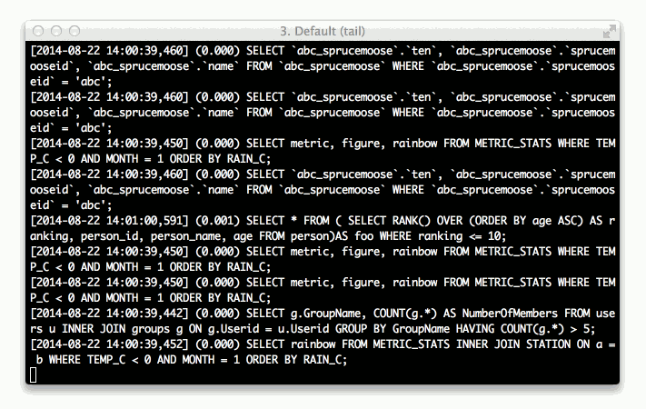

****************************************
taileff: tail -f for humans
****************************************

taileff makes it easier to read the output of tail -f, using features such as:

* syntax highlighting
* line numbering
* separating lines
* grouping separators
* indentation (only for SQL atm)

Installation
------------

.. code-block:: bash

    $ pip install taileff

Usage
-----

.. code-block:: bash

    $ tailf <file> [-s -i -n -l <language> -g <seconds>]
    $ tailf --help

Example
-------

.. code-block:: bash

    Separating lines, line numbering, SQL indentation, and SQL syntax highlighting
    $ tailf -sin --lang sql django_sql.log

Licence
-------

BSD
